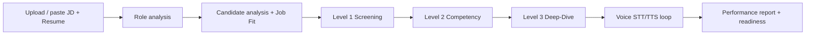

# EDXSO Assignment 3 — Interview Accelerator

AI-powered **Interview Accelerator** that turns a Job Description + Resume into a personalised, adaptive **voice interview** and readiness report.

Inspired by the candidate problem space around [Student Credibility](https://studentcredibility.com): students often have a resume and JD, but not a clear sense of fit, likely questions, or readiness.

**Live app:** https://edxso-interview-accelerator.vercel.app  
**Repo:** https://github.com/nishant-uxs/edxso-interview-accelerator  
**Demo video:** https://www.loom.com/share/2ee7affcbc1a4c3fadba26bd1733758e

### Demo video note

Loom’s free plan caps a single recording at **5 minutes**, so this capture ends mid-interview before the full **Report + Download report PDF** segment.  

The complete journey is available on the live app:

**Input → Role → Fit → adaptive voice interview (3 levels) → evaluation report → PDF export**

Please continue the remaining steps on: https://edxso-interview-accelerator.vercel.app

## Product flow



1. **Input** — paste or upload JD + resume (txt / pdf / docx)  
2. **Understand the role** — title, skills, competencies, keywords  
3. **Understand the candidate** — strengths, gaps, claims to probe, job-fit %  
4. **AI interview (3 levels)** — screening → competency → deep-dive  
5. **Voice** — AI speaks questions (TTS); candidate answers by voice (STT) or text  
6. **Video (bonus)** — optional camera booth  
7. **Report** — overall score, competencies, question feedback, prep gaps, readiness  

## Adaptive interview intelligence

- Questions are generated from **this JD + this resume + prior answers** (not a fixed bank).  
- Deep-dive challenges metrics, tradeoffs, and vague answers.  
- Difficulty shifts harder/easier based on the last response.  
- Context retained: role needs, claims, strengths/weaknesses, topics covered.  

## Voice implementation

| Piece | Implementation |
|-------|----------------|
| Speech-to-text | Browser **Web Speech API** (`SpeechRecognition` / `webkitSpeechRecognition`) |
| Text-to-speech | Browser **speechSynthesis** (AI interviewer voice) |
| LLM | Gemini via OpenAI-compatible API (`OPENAI_BASE_URL`) |
| Video (bonus) | `getUserMedia` camera preview — evaluation still answer-quality first |

Chrome/Edge recommended for voice.

## Stack

- **Next.js (App Router) + TypeScript + Tailwind**  
- **API routes:** `/api/analyze`, `/api/interview/next`, `/api/interview/evaluate`  
- **LLM:** Gemini Flash family (free-tier friendly, model rotation)  
- **Files:** `unpdf`, `mammoth`  
- **Report PDF:** `jspdf` (client download)  
- **Deploy:** Vercel  

## Quick start

```bash
npm install
cp .env.example .env.local
# set OPENAI_API_KEY + OPENAI_BASE_URL (Gemini OpenAI-compat)

npm run dev
# http://localhost:3000
```

### Environment

```bash
OPENAI_API_KEY=...
OPENAI_BASE_URL=https://generativelanguage.googleapis.com/v1beta/openai/
OPENAI_MODEL=gemini-flash-lite-latest
OPENAI_FALLBACK_MODELS=gemini-2.0-flash,gemini-flash-lite-latest
```

## Architecture

```mermaid
flowchart TB
  UI[Next.js UI] --> A[/api/analyze]
  UI --> N[/api/interview/next]
  UI --> E[/api/interview/evaluate]
  A --> LLM[Gemini OpenAI-compat]
  N --> LLM
  E --> LLM
  UI --> STT[Web Speech STT]
  UI --> TTS[speechSynthesis TTS]
  UI --> CAM[getUserMedia video]
```

### Evaluation methodology

- Competency scores: role fit, technical knowledge, problem solving, communication, confidence, depth, behavioural fit  
- Question-level: assessment, what was good, what could be better, ideal direction  
- Readiness: `not_ready` → `needs_preparation` → `interview_ready` → `strong_candidate` from interview + JD alignment  

## Demo script (for video)

1. Paste a real JD + your resume  
2. Walk Role → Fit screens  
3. Start interview — allow mic; answer 2–3 questions by voice  
4. Toggle camera once (bonus)  
5. Finish → show report + prep gaps + readiness  
6. **Download report PDF** (shareable performance pack)

## Assignment mapping

| Requirement | Status |
|-------------|--------|
| JD + resume input/upload | Yes |
| Role + candidate analysis | Yes |
| Job fit score | Yes |
| 3 interview levels | Yes |
| Dynamic follow-ups | Yes |
| Voice interview | Yes (Web Speech) |
| Evaluation + readiness | Yes |
| Download report PDF | Yes (jsPDF) |
| Web UI | Yes |
| Video | Bonus camera booth |
| Demo video | [Loom](https://www.loom.com/share/2ee7affcbc1a4c3fadba26bd1733758e) (5‑min cap note above) |
| Live deploy | Vercel |

## License

MIT — EDXSO AI Product Engineer Intern Assignment 3.
